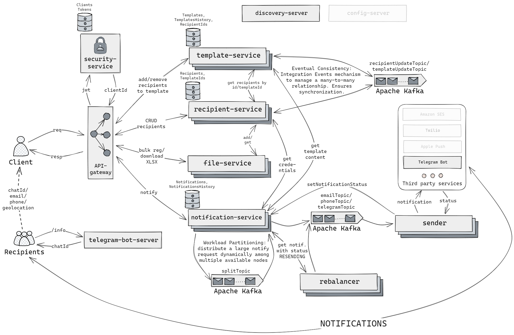
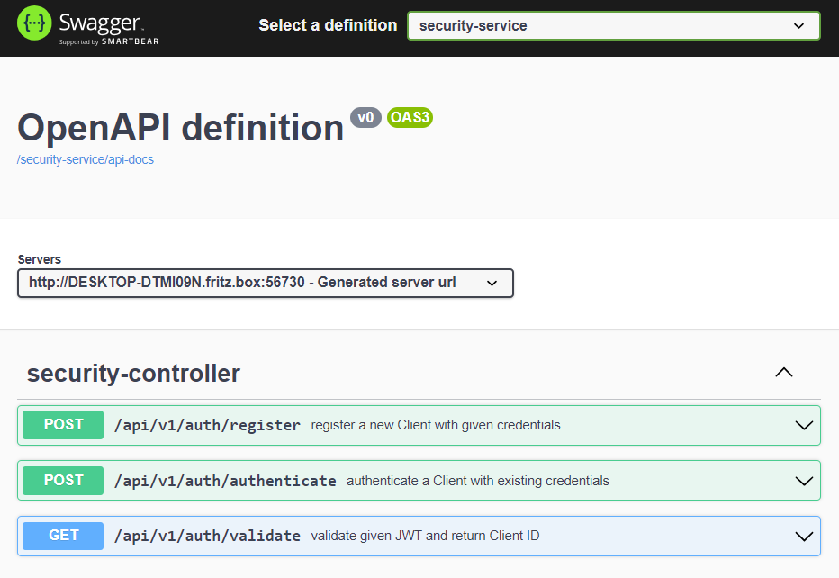

# Emergency Notification System

> This system allows you to quickly and efficiently send notifications to a large number of recipients during emergency
> situations.

## Functional requirements:

- [x] **Notification Sending:** Clients should be able to send notifications to the registered recipients, alerting them
  about emergency situations, through different communication channels, such as:
    - [ ] email
    - [x] telegram
    - [ ] push notifications
    - [ ] SMS
- [x] **Bulk Recipient Registration:** The system should support registering a large number of recipients at once by
  importing data from:
    - [x] .xlsx
    - [ ] .csv
- [x] **Notification Templates:**  The system should allow clients to create and manage pre-defined notification
  templates for instantaneously sending notifications.
- [ ] **Geolocation Sending:** The system should support sending notifications based on the recipient's geolocation to
  provide location-specific information during emergencies.
- [ ] **Recipient Response:** Recipients should have the capability to respond to notifications, providing their safety
  status or any other pertinent information (e.g., indicating whether they are safe and currently located in a shelter).

## Non-functional requirements:

- [ ] **High Availability:** The system should be highly available, ensuring that it is accessible and operational even
  during peak usage or in the event of system failures.
- [x] **Reliability:** The system should be reliable and deliver notifications consistently without any data loss or
  delays.
- [x] **Low Latency:** The system should have low latency, ensuring that notifications are sent and received promptly to
  minimize response time during emergencies.
- [x] **Scalability:** The system should be able to handle a growing number of recipients and notifications without
  compromising performance or functionality.

## Additional Features:

- **Email Update Guarantee:** When registering a recipient with an email address that already exists in the system, the
  existing recipient's information will be updated with the new registration details. (if there are several equal email
  addresses in xlsx file, the last appearance will always overwrite all previous)

##

## Architecture Diagram

##

### Scalability / Low Latency

The system is designed to efficiently deliver notifications to a large number of users in a timely manner. To achieve
scalability and low latency, the system employs the following logic:

- `Request Partitioning:` When a client sends a request with a large list of user IDs to whom notifications need to be
  sent, the system dynamically determines the number of instances currently running using the Eureka Discovery Server.
  This information is then used to divide the list of user IDs into equal partitions. For example, if the
  recipient-management-service receives a request with 1,000,000 user IDs and there are 100 instances currently
  running, the receiving instance will divide the list into batches of 10,000 user IDs each and distribute them to all
  available instances using Apache Kafka.

- `Parallel Processing:` With multiple instances in operation, the system achieves parallel processing of user
  notifications. This parallel processing significantly improves the overall performance and reduces the time required
  to send notifications.

- `Result Aggregation:` After processing the user IDs, the system sends the processed entities back to Kafka, but this
  time to a different service responsible for sending out the actual notifications. This separation of processing and
  notification delivery allows for modular and scalable architecture.

### Reliability

To ensure reliability in the system, the following steps were implemented using the rebalancer and sender services:

- `Sender Service:` When the sender service encounter an error while sending a notification, it marks it as "RESENDING."
  This step allows for tracking notifications that may require reprocessing in case of failures or inconsistencies.

- `Rebalancer Service:` The rebalancer service periodically retrieves notifications marked as "RESENDING." By doing so,
  it actively monitors for any failed deliveries or pending notifications, ensuring that no data loss occurs.

- `Transmitting to Kafka:` Once the rebalancer service retrieves the "RESENDING" notifications, it transmits them back
  to the Kafka system. This step facilitates the consistent delivery of notifications, mitigating any potential delays
  or issues that may have occurred during the initial sending process.

### Endpoints documentation

> Access all API documentation in one place using Ape-Gateway's centralized approach.
> Explore endpoints and their functionalities conveniently through
> this [link](http://localhost:8080/webjars/swagger-ui/index.html).

#### security-service

#### recipient-service

#### template-service

#### notification-service

#### file-service

